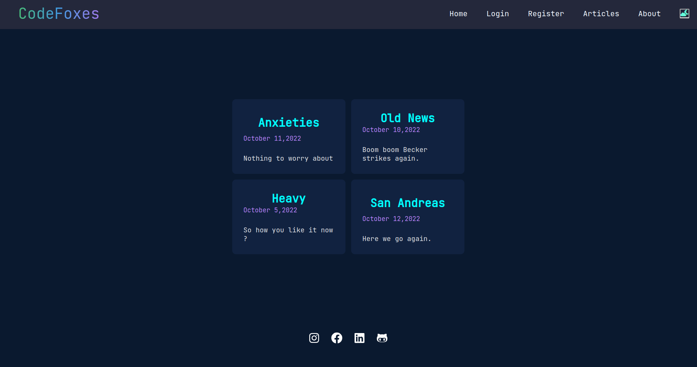

# To-Learn-Problems
To-Learn-Problems will provide a lots of problems on various topics for person to get mastery in that topic. Problems will be of all levels and categories.

## Guidelines

- Add new features in this project.
- Dockeries this project.
- Find bugs and solve them.

## Getting Started

- Fork this repo
- Star this repo
- Clone on your local machine

### Glimpses of the Projects



### Installation and Setting up the Project
```
git clone <repo-name>
```

```
git add .
git commit -m 'About your contribution'
git push
```
- Create a new pull request from your forked repository
- Your PR gets merged!
- Now you can also help others do the same.